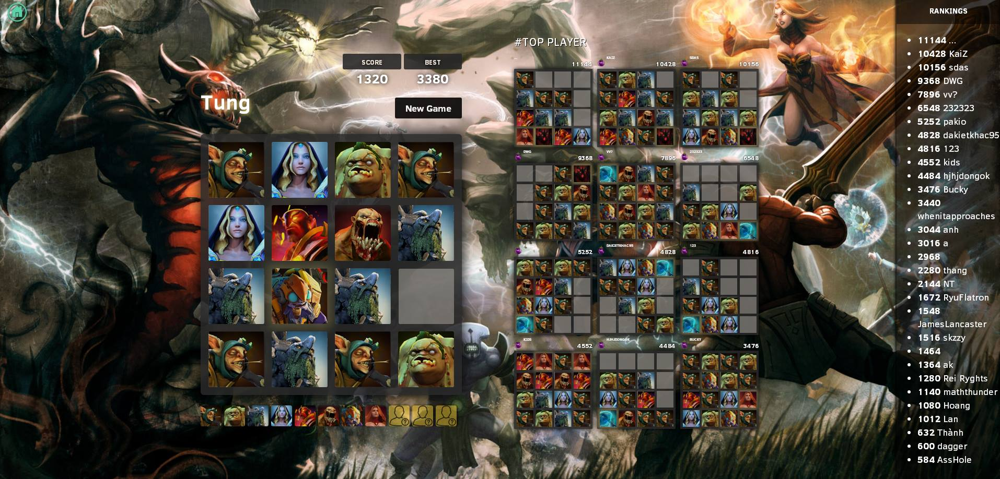

This is version for artists with multiplayer online (web/mobile/native app - use cordova).

# Features
- Multiplayer online
- Mode solo 1 vs 1
- LeaderBoard
- Top Players
- Facebook comment,like share in game
- Manager games
- Support Mobile/Tablet and Hybrid App (with cordova)

# Live demo

Screenshot game:

Link demo : http://xsystem.io:6789

# Installation

1. Clone project `git clone https://github.com/tungtouch/Game-2048-Players-Online.git`
2. `cd Game-2048-Players-Online`
3. `npm install`
4. Restore database mongodb : `mongorestore dump`
5. Run app : `node app --prod`
6. Fix link images: `http://[your_server]:6789/v1/player/fixlink`
7. Go to `http://[your_server]:6789`

# Deploy with cordova

1. In file `/Cordova/www/index.html` line `47` please replace your website want change to here.
2. Read guide deploy with cordova at here http://docs.phonegap.com/

### Source code used by:
- Node.js
- Sails Framework
- Socket.io
- Library [2048](https://github.com/gabrielecirulli/2048)
- Bootstrap
- jQuery
- SweetAlert
- MongoDB
- Redis

